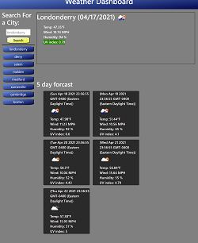

# Weather Application
## Description
```

```

## Acceptance Criteria


To create a weather dashboard with form inputs where user can search for a city and is then presented with current and future conditions for that city and that city is added to the search history. Then when user wants to view current weather conditions for that city, they presented with the city name, the date, an icon representation of weather conditions, the temperature, the humidity, the wind speed, and the UV index. Then when they view the UV index, they presented with a color that indicates whether the conditions are favorable, moderate, or severe. Next when they view future weather conditions for that city, they presented with a 5-day forecast that displays the date, an icon representation of weather conditions, the temperature, the wind speed, and the humidity. Then when they click on a city in the search history then they are again presented with current and future conditions for that city

## Table of Contents

- [Installation](#installation)
- [Screenshot](#screenshot)
- [Website](#website)
- [Credits](#credits)
- [License](#license)


## Installation
Once pulled over from gitHub onto your local machine.
- First is to open up Microsoft Visual Studio Code.

- Then over on the side bar click ad folder to workspace

- Once you see on the files, to view in browser, right click index.html under workspace and then click Reveal in file explorer.

- Once the window comes up with the file. Just double click the file and the file will open up in the browser of your choice. 

## Screenshot

Here is a screenshot of the actual webpage.
 
 
<br>
## Credits
https://bootcamp.unh.edu/ 

https://coding-boot-camp.github.io/full-stack/github/professional-readme-guide

https://choosealicense.com/


## Website
https://coreynance.github.io/WeatherApplication/

## License
MIT License

Copyright (c) [2021] [Corey Nance]

Permission is hereby granted, free of charge, to any person obtaining a copy
of this software and associated documentation files (the "Software"), to deal
in the Software without restriction, including without limitation the rights
to use, copy, modify, merge, publish, distribute, sublicense, and/or sell
copies of the Software, and to permit persons to whom the Software is
furnished to do so, subject to the following conditions:

The above copyright notice and this permission notice shall be included in all
copies or substantial portions of the Software.

THE SOFTWARE IS PROVIDED "AS IS", WITHOUT WARRANTY OF ANY KIND, EXPRESS OR
IMPLIED, INCLUDING BUT NOT LIMITED TO THE WARRANTIES OF MERCHANTABILITY,
FITNESS FOR A PARTICULAR PURPOSE AND NONINFRINGEMENT. IN NO EVENT SHALL THE
AUTHORS OR COPYRIGHT HOLDERS BE LIABLE FOR ANY CLAIM, DAMAGES OR OTHER
LIABILITY, WHETHER IN AN ACTION OF CONTRACT, TORT OR OTHERWISE, ARISING FROM,
OUT OF OR IN CONNECTION WITH THE SOFTWARE OR THE USE OR OTHER DEALINGS IN THE
SOFTWARE.
